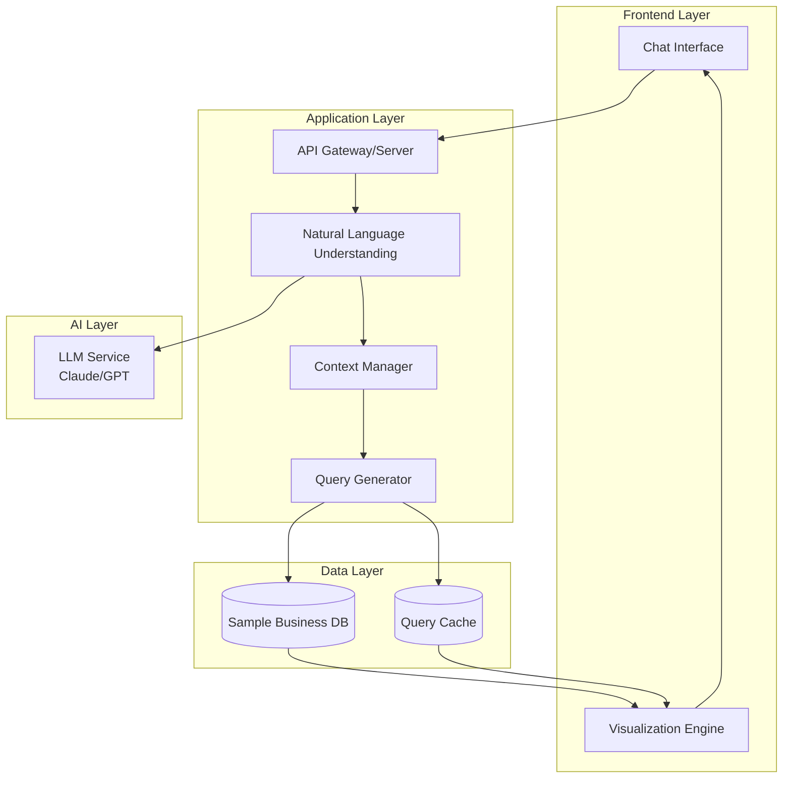
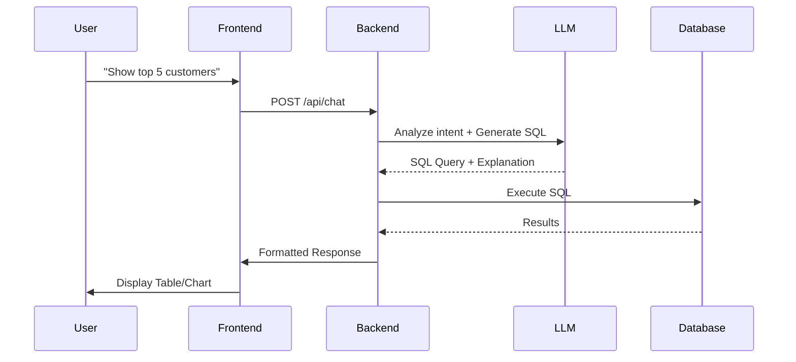

# Business Intelligence Chat System - Technical Documentation -- v2

## Executive Summary

A conversational interface that enables business decision-makers to query company data using natural language, eliminating the need for SQL knowledge or analyst dependencies.

**Target Users:** CEOs, Sales Directors, Operations Managers  
**Core Value:** Transform business questions into actionable insights through natural conversation

---

## Table of Contents

1. [System Architecture](#system-architecture)
2. [Technology Stack](#technology-stack)
3. [Iteration Plan](#iteration-plan)
4. [Implementation Details](#implementation-details)
5. [Data Model](#data-model)
6. [API Design](#api-design)
7. [Deployment Strategy](#deployment-strategy)

---

## System Architecture

### High-Level Architecture



### Component Responsibilities

| Component | Responsibility | Technology |
|-----------|---------------|------------|
| Chat Interface | User interaction, message display | React + Tailwind |
| Visualization Engine | Charts, tables, formatted output | Recharts/Chart.js |
| API Gateway | Request routing, authentication | Express/FastAPI |
| NLU Module | Intent classification, entity extraction | LLM + Prompt Engineering |
| Context Manager | Conversation state, pronoun resolution | In-memory store |
| Query Generator | SQL generation from intent | Text-to-SQL |
| Sample Business DB | Mock business data | SQLite/PostgreSQL |

---

## Technology Stack

### Recommended Stack (Fast Development)

#### **Option 1: Full JavaScript Stack** (Recommended for 3-day deadline)

**Frontend:**
- React (Vite for fast setup)
- Tailwind CSS (rapid styling)
- Recharts (easy charting)
- Axios (API calls)

**Backend:**
- Node.js + Express
- Better-sqlite3 (embedded database)
- OpenAI SDK

**Why this stack:**
- Single language across stack
- Fast prototype-to-production
- Rich ecosystem
- Easy deployment (Vercel/Netlify + Backend on Railway)

#### **Option 2: Python Backend** (If you prefer Python)

**Frontend:** Same as above

**Backend:**
- FastAPI (async, fast)
- SQLAlchemy (ORM)
- Anthropic SDK / LangChain
- SQLite

---

## Iteration Plan

### Iteration 1: MVP Foundation (Day 1 - 8 hours)

**Goal:** Basic working chat with hardcoded responses

**Deliverables:**
1. Chat UI with message history
2. Sample business database with realistic data
3. Basic Express server
4. Hardcoded question-answer pairs

**Sample Hardcoded Responses:**

```javascript
const hardcodedResponses = {
  "top customers": {
    type: "table",
    query: "SELECT SUM(amount) as revenue FROM orders WHERE status = 'completed'...",
    data: [/* mock data */]
  }
};
```

**Success Criteria:**
- ✅ Chat interface renders messages
- ✅ Database contains realistic sample data (100+ customers, 1000+ orders)
- ✅ Server responds to 3 predefined questions
- ✅ Can display results in a table

---

### Iteration 2: LLM Integration (Day 2 - 6 hours)

**Goal:** Dynamic query understanding using LLM

**Architecture Flow:**



**LLM Prompt Template:**

```
You are a SQL expert for a business intelligence system.

Database Schema:
{schema_description}

User Question: {user_question}

Generate a SQL query to answer this question. Return JSON:
{
  "sql": "SELECT ...",
  "explanation": "This query finds...",
  "visualization": "table|bar_chart|line_chart"
}

Rules:
- Only use tables: customers, orders, products
- Always include LIMIT clause
- Return proper aggregations
- Handle date ranges appropriately
```

**Implementation:**

```javascript
async function processQuestion(question, conversationHistory) {
  const prompt = buildPrompt(question, conversationHistory);
  
  const response = await anthropic.messages.create({
    model: "claude-sonnet-4-20250514",
    max_tokens: 1000,
    messages: [{
      role: "user",
      content: prompt
    }]
  });
  
  const { sql, explanation, visualization } = parseResponse(response);
  
  // Execute SQL safely
  const results = await db.prepare(sql).all();
  
  return {
    answer: explanation,
    data: results,
    vizType: visualization
  };
}
```

**Success Criteria:**
- ✅ LLM generates valid SQL from natural language
- ✅ System handles 10+ different question types
- ✅ Error handling for invalid queries
- ✅ Response time < 3 seconds

---

### Iteration 3: Context Management (Day 2 - 4 hours)

**Goal:** Handle follow-up questions with context

**Context Manager Design:**

```javascript
class ConversationContext {
  constructor() {
    this.history = [];
    this.entities = {};
  }
  
  addMessage(role, content, metadata = {}) {
    this.history.push({
      role,
      content,
      metadata,
      timestamp: Date.now()
    });
    
    // Extract entities from results
    if (metadata.entities) {
      this.updateEntities(metadata.entities);
    }
  }
  
  updateEntities(newEntities) {
    // Store referenced customers, products, time periods
    this.entities = {
      ...this.entities,
      ...newEntities,
      lastUpdated: Date.now()
    };
  }
  
  getContext() {
    return {
      recentMessages: this.history.slice(-5),
      currentEntities: this.entities
    };
  }
}
```

**Pronoun Resolution:**

```
Enhanced LLM Prompt:

Conversation Context:
Previous Question: "Show top 5 customers by revenue"
Referenced Entities: {customer_ids: [1,2,3,4,5]}

Current Question: "What products are they buying?"

Resolve "they" to the customer_ids from context and generate SQL.
```

**Success Criteria:**
- ✅ Handles "they", "them", "those" pronouns
- ✅ Maintains context for 5+ messages
- ✅ Correctly references previous results
- ✅ "What about last quarter?" works after "this quarter" query

---

### Iteration 4: Visualization & Polish (Day 2-3)

**Goal:** Beautiful, actionable insights

**Visualization Logic:**

```javascript
const visualizationRules = {
  // Single number metrics
  isMetric: (data) => data.length === 1 && Object.keys(data[0]).length <= 2,
  
  // Time series
  isTimeSeries: (data) => data[0].hasOwnProperty('date') || 
                           data[0].hasOwnProperty('month'),
  
  // Rankings/Comparisons
  isRanking: (data) => data.length > 1 && data.length <= 20,
  
  // Large datasets
  isTable: (data) => data.length > 20
};

function selectVisualization(data, suggestedType) {
  if (visualizationRules.isMetric(data)) return 'metric_card';
  if (visualizationRules.isTimeSeries(data)) return 'line_chart';
  if (visualizationRules.isRanking(data)) return 'bar_chart';
  return 'table';
}
```

**Chart Components:**

```jsx
// Metric Card
<MetricCard 
  value={data[0].revenue}
  label="Total Revenue"
  trend="+12.5%"
  comparison="vs last quarter"
/>

// Bar Chart
<BarChart data={data} xKey="customer_name" yKey="revenue" />

// Line Chart  
<LineChart data={data} xKey="date" yKey="revenue" />

// Table
<DataTable 
  data={data}
  sortable={true}
  exportable={true}
/>
```

**Success Criteria:**
- ✅ Automatic visualization selection
- ✅ Responsive charts
- ✅ Export to CSV functionality
- ✅ Loading states and error messages

---

## Implementation Details

### Project Structure

```
bi-chat-system/
├── frontend/
│   ├── src/
│   │   ├── components/
│   │   │   ├── ChatInterface.jsx
│   │   │   ├── MessageBubble.jsx
│   │   │   ├── DataVisualization.jsx
│   │   │   └── ChartComponents/
│   │   ├── services/
│   │   │   └── api.js
│   │   └── App.jsx
│   ├── package.json
│   └── vite.config.js
│
├── backend/
│   ├── src/
│   │   ├── routes/
│   │   │   └── chat.js
│   │   ├── services/
│   │   │   ├── llm.js
│   │   │   ├── database.js
│   │   │   └── context.js
│   │   ├── utils/
│   │   │   ├── promptBuilder.js
│   │   │   └── sqlValidator.js
│   │   └── server.js
│   ├── database/
│   │   ├── schema.sql
│   │   └── seed.js
│   └── package.json
│
└── README.md
```

### Quick Start Commands

```bash
# Setup Frontend
cd frontend
npm create vite@latest . -- --template react
npm install axios recharts lucide-react
npm install -D tailwindcss postcss autoprefixer
npx tailwindcss init -p

# Setup Backend (Node.js)
cd backend
npm init -y
npm install express better-sqlite3 @anthropic-ai/sdk cors dotenv
npm install -D nodemon

# Setup Backend (Python alternative)
cd backend
python -m venv venv
source venv/bin/activate  # Windows: venv\Scripts\activate
pip install fastapi uvicorn anthropic sqlalchemy
```

---

## Data Model

### Sample Data Generation Strategy

```javascript
// Generate realistic business data
function generateSampleData() {
  const customers = [];
  const orders = [];
  const products = [
    { id: 1, name: 'Enterprise SaaS License', category: 'Software', price: 999 },
    { id: 2, name: 'Professional Services', category: 'Service', price: 150 },
    { id: 3, name: 'Cloud Storage Pro', category: 'Infrastructure', price: 299 },
    // ... more products
  ];
  
  // Generate 100 customers
  for (let i = 1; i <= 100; i++) {
    customers.push({
      id: i,
      name: `Company ${i}`,
      email: `contact@company${i}.com`,
      signup_date: randomDate(2020, 2024),
      industry: randomIndustry(),
      status: randomStatus()
    });
  }
  
  // Generate 1000+ orders with patterns
  // - Loyal customers have regular orders
  // - At-risk customers have declining order frequency
  // - Churned customers stopped ordering
  
  return { customers, orders, products };
}
```

### Key Metrics to Include

1. **Revenue Metrics:**
   - Total revenue (by period)
   - Revenue by customer
   - Revenue by product
   - Revenue growth trends

2. **Customer Health:**
   - Order frequency
   - Days since last order
   - Average order value
   - Customer lifetime value

3. **Product Performance:**
   - Top selling products
   - Product category breakdown
   - Product bundling patterns

---

## API Design

### Endpoints

```
POST /api/chat
Body: {
  message: string,
  conversation_id?: string
}
Response: {
  answer: string,
  data: array,
  visualization: string,
  sql?: string (debug mode),
  conversation_id: string
}

GET /api/conversations/:id
Response: {
  messages: array,
  entities: object
}

POST /api/export
Body: {
  data: array,
  format: 'csv' | 'json'
}
Response: file download
```

---

## Advanced Features (Time Permitting)

### Churn Prediction Logic

```sql
-- Simple rule-based churn detection
WITH customer_metrics AS (
  SELECT 
    customer_id,
    MAX(order_date) as last_order_date,
    COUNT(*) as order_count,
    AVG(amount) as avg_order_value,
    JULIANDAY('now') - JULIANDAY(MAX(order_date)) as days_since_last_order
  FROM orders
  GROUP BY customer_id
)
SELECT 
  c.name,
  cm.days_since_last_order,
  cm.order_count,
  CASE 
    WHEN cm.days_since_last_order > 90 THEN 'High Risk'
    WHEN cm.days_since_last_order > 60 THEN 'Medium Risk'
    ELSE 'Healthy'
  END as churn_risk
FROM customers c
JOIN customer_metrics cm ON c.id = cm.customer_id
WHERE cm.days_since_last_order > 60
ORDER BY cm.days_since_last_order DESC;
```

### Query Caching

```javascript
const queryCache = new Map();

function getCacheKey(sql, params) {
  return `${sql}:${JSON.stringify(params)}`;
}

async function executeWithCache(sql, params = []) {
  const key = getCacheKey(sql, params);
  
  if (queryCache.has(key)) {
    return queryCache.get(key);
  }
  
  const results = await db.prepare(sql).all(params);
  queryCache.set(key, results);
  
  // Expire after 5 minutes
  setTimeout(() => queryCache.delete(key), 5 * 60 * 1000);
  
  return results;
}
```

---

## Deployment Strategy

### Development
```bash
# Frontend: localhost:5173
npm run dev

# Backend: localhost:3000
npm run dev
```

### Production Options

**Option 1: All-in-One Platform**
- Vercel (Frontend + API routes)
- Railway (Backend + Database)

**Option 2: Separate Services**
- Frontend: Netlify/Vercel
- Backend: Render/Railway/Fly.io
- Database: SQLite file or PostgreSQL (Supabase)

**Environment Variables:**
```
ANTHROPIC_API_KEY=sk-...
DATABASE_URL=sqlite:./business.db
NODE_ENV=production
CORS_ORIGIN=https://your-frontend.vercel.app
```

---

## Testing Checklist

### Core Functionality
- [ ] Basic questions return correct data
- [ ] Follow-up questions use context correctly
- [ ] Visualizations render properly
- [ ] Error messages are user-friendly

### Edge Cases
- [ ] Ambiguous questions prompt for clarification
- [ ] Invalid SQL generates safe errors
- [ ] Empty results show helpful message
- [ ] Large datasets paginate correctly

### Performance
- [ ] Response time < 3 seconds
- [ ] Smooth scrolling with many messages
- [ ] Charts render without lag

---

## Demo Script

### Scenario: Executive Dashboard Review

```
1. User: "What's our total revenue this year?"
   → Shows metric card with trend

2. User: "Show me monthly breakdown"
   → Line chart of revenue over time

3. User: "Which customers contributed most?"
   → Bar chart of top 10 customers

4. User: "What are they buying?"
   → Table showing products by those top customers

5. User: "Any at risk of churning?"
   → Alert list with churn risk scores and reasons
```

---

## Risk Mitigation

| Risk | Impact | Mitigation |
|------|--------|-----------|
| LLM generates invalid SQL | High | SQL validation layer, whitelist tables |
| Slow response time | Medium | Query caching, optimize database |
| Context lost in conversation | Medium | Robust context manager, entity tracking |
| Incorrect data interpretation | High | Show SQL in debug mode, allow user feedback |

---

## Next Steps After Submission

1. **User Feedback Loop:** Add thumbs up/down for responses
2. **Advanced Analytics:** Integrate actual ML models for predictions
3. **Multi-tenancy:** Support multiple companies/datasets
4. **Authentication:** Add user management
5. **Real Database:** Connect to actual data warehouses (Snowflake, BigQuery)

---

## Resources & References

- **LangChain Text-to-SQL:** https://python.langchain.com/docs/use_cases/sql
- **Anthropic Prompt Library:** https://docs.anthropic.com/claude/page/text-to-sql
- **Recharts Documentation:** https://recharts.org/
- **SQL Injection Prevention:** OWASP guidelines

---

## Conclusion

This architecture balances speed of development with scalability. The iterative approach ensures you have a working demo at each stage, reducing risk and allowing for pivots based on what you learn.

**Key Success Factors:**
1. Start simple, add complexity incrementally
2. Use frameworks and libraries extensively
3. Focus on the core user experience
4. Keep scope manageable for 3-day timeline

Good luck with your submission! 🚀